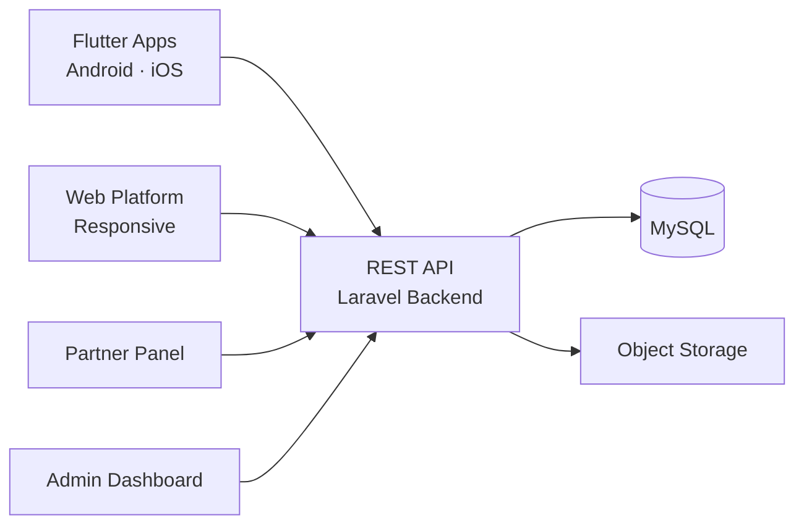

# Blinkit Clone — White-Label Solution by Miracuves

---

## Table of Contents

1. [Who Is This For?](#who-is-this-for)
2. [How It Works](#how-it-works)
3. [Core Features](#core-features)
4. [Architecture](#architecture)
5. [Revenue Streams](#revenue-streams)
6. [What's Included](#whats-included)
7. [Deployment Timeline](#deployment-timeline)
8. [Why Not Build From Scratch?](#why-not-build-from-scratch)
9. [Market Opportunity](#market-opportunity)
10. [Client Testimonials](#client-testimonials)
11. [FAQ](#faq)
12. [Resources](#resources)
13. [About Miracuves](#about-miracuves)

## Live Demos

| Environment | URL | What you can test |
|---|---|---|
| Web Platform | [mxepto.mimeld.com](https://mxepto.mimeld.com) | Full experience in the browser |
| Admin Dashboard | [Solution page → Demo](https://miracuves.com/blinkit-clone/#demo) | Users, content, plans, analytics |

Demo credentials: [miracuves.com/blinkit-clone -> Demo section](https://miracuves.com/blinkit-clone/#demo)

## What Makes This Blinkit Clone Different

<!-- TODO: fill 3-5 vertical-specific differentiators -->

## Who Is This For?

| Buyer Type | Use Case |
|---|---|
| Startup Founders | Launch a 10-minute instant delivery service |
| Retail Chains | Add online ordering with instant delivery to existing stores |
| Dark Store Operators | Build a network of fulfilment centres with one platform |

---

## How It Works

1. Customer browses the catalog of nearby dark stores and adds items
2. Order is routed to the nearest dark store with in-stock items
3. Store picks and packs in under 60 seconds
4. Delivery partner collects and navigates the optimized route to customer
5. Customer receives real-time tracking and ETA updates
6. Delivery completed; live tracking confirms drop-off

---

## Core Features

### Customer App
- Product catalog
- Smart search
- Cart & checkout
- Scheduled delivery
- Real-time tracking
- Subscriptions
- Saved favorites
- Payment options

### Store Panel
- Inventory management
- Order picking
- Analytics
- Promotions

### Picker App
- Pick list
- Route optimization
- Barcode scanning
- Proof of delivery

### Admin Panel
- Store onboarding
- Inventory sync
- Commission mgmt
- Analytics dashboard
- Delivery zones

---

## Advanced Features

The platform integrates AI-powered features that reduce manual overhead and capture revenue opportunities:

- **AI Demand Forecasting** - Predicts product demand per zone per hour for optimal stock placement
- **AI Route Optimization** - Calculates the fastest delivery routes for sub-10-minute delivery
- **AI Inventory Planning** - Automatically recommends restock levels based on sales velocity
- **AI Substitutions** - Smart suggestions for out-of-stock items

---

## Apps and Web Panels

| Module | Description |
|---|---|
| Customer App (iOS + Android) | Browse, cart, order, track, pay |
| Delivery Partner App (iOS + Android) | Pickup, navigation, proof of delivery |
| Dark Store Web Panel | Inventory, picking, alerts, reports |
| Admin Web Panel | Stores, zones, drivers, analytics |

---

## Architecture

**Stack:**

| Layer | Technology |
|---|---|
| Mobile Apps | Flutter (iOS + Android, single codebase) |
| Backend API | Node.js + Express |
| Database | MongoDB |
| Real-time | WebSockets (Socket.io) |
| Maps and Routing | Google Maps API / Mapbox |
| Payments | Stripe, Razorpay, PayPal |
| Notifications | Firebase Cloud Messaging (FCM) |
| Cloud Hosting | AWS / DigitalOcean / Contabo VPS |
| Admin Panel | React.js |

---

## Revenue Streams

The platform is engineered to generate revenue from day one through multiple complementary channels:

- **Commission per order** - take 15-25% from each sale
- **Delivery fees** - flat or distance-based charges per order
- **Subscription memberships** - monthly premium with free delivery
- **Promoted listings** - vendors pay for category visibility
- **Surge delivery fees** - higher fees during peak hours
- Commission per order
- Delivery fee
- Store subscription
- Promoted products
- Surge pricing

---

## Security and Compliance

- OTP-based authentication
- SSL/TLS encrypted API communication
- GDPR-ready data handling

---

## What's Included

| Plan | Price | What You Get |
|---|---|---|
| Standard | **$2,899** | Complete source code, all apps, admin panel, rebranding, 1 year updates |
| Enterprise | Custom Quote | Everything in Standard + custom features, multi-region, priority support |

**What is included:**

- Customer App (iOS + Android)
- Delivery Partner App (iOS + Android)
- Dark Store Web Panel
- Admin Web Panel
- Full Source Code
- Complete Rebranding (your logo, colors, app name)
- Server Deployment
- App Store and Google Play Submission Support
- 60 Days Free Bug Support
- Free 1-Year Updates

---
**Pricing:** from **$2,899** — transparent on the [solution page](https://miracuves.com/blinkit-clone/#pricing).

## Deployment Timeline

| Day | Milestone |
|---|---|
| Day 1 | Server setup, environment configuration, initial deployment |
| Day 2 | White-labeling - app name, logo, colors, splash screens |
| Day 3 | Payment gateway integration + third-party API configuration |
| Day 4 | Custom feature implementation (if applicable) |
| Day 5 | QA, testing, bug fixes across all panels |
| Day 6 | App Store + Google Play submission + Go-live |

> **Average go-live: 6 business days from payment confirmation.**

---

## Why Not Build From Scratch?

| Factor | Build from Scratch | Miracuves Solution |
|---|---|---|
| Time to Launch | 6-12 months | 6 days |
| Development Cost | $60,000-$150,000 | From $2,899 |
| Source Code Ownership | Yes | Yes |
| Customization | Full | Full |
| Post-Launch Support | Depends on team | 60 days included |
| Risk | High | Low |

---

## Market Opportunity

| Metric | Data |
|---|---|
| Global Q-Commerce Market (2024) | $35 billion |
| Projected Market Size (2030) | $72 billion |
| CAGR | ~30% |
| Key Growth Markets | India, SEA, MENA, LatAm |
| Average Delivery Time Target | Under 10 minutes |

> Source: Statista, Grand View Research, Allied Market Research

---

## Successful Verticals

- 10-minute grocery delivery (like Blinkit, Zepto)
- Pharmacy and medicine instant delivery
- Pet supplies and specialty instant delivery
- Convenience store instant delivery
- Quick commerce groceries
- Organic food delivery
- Pet supplies delivery
- Baby essentials delivery
- Household goods delivery

---

## Client Testimonials

> *"We hit 1,000 orders on day three. The 10-minute delivery promise works because the routing engine is that good."*
> - CEO, Q-Commerce Startup

> *"Exceptional results from day one."*
> - Verified Client

> *"Scaled 3x faster than expected."*
> - Startup Founder

---

## FAQ

**How much does a Blinkit clone cost?**
A white-label Blinkit clone from Miracuves starts at $2,899 with complete source code ownership.

**Can it do 10-minute delivery?**
Yes. The platform is optimized for hyperlocal logistics with dark store sync and route optimization.

**How many dark stores can I manage?**
Unlimited. The platform supports a network of dark stores with real-time inventory sync.

**Do I get the source code?**
Yes. Complete source code ownership is included - no vendor lock-in.

**How long does it take to launch?**
6 business days from payment confirmation.

---

## Related Solutions

Explore our other white-label clone solutions:

- [AmazonFresh Clone - Grocery Delivery](https://github.com/Miracuves-Solutions/AmazonFresh-Clone)
- [BigBasket Clone - Multi-Vendor Grocery](https://github.com/Miracuves-Solutions/BigBasket-Clone)
- [Instacart Clone - Grocery Marketplace](https://github.com/Miracuves-Solutions/Instacart-Clone)

---

## Resources

- [Full Solution Page](https://miracuves.com/blinkit-clone/) — features, pricing, demos, FAQ

## Get Started

**Ready to launch your q-commerce instant delivery business?**

| Channel | Link |
|---|---|
| Full Solution Page | [miracuves.com/blinkit-clone](https://miracuves.com/blinkit-clone/) |
| Email | info@miracuves.com |
| WhatsApp | [+91 98300 09649](https://wa.me/919830009649) |
| Book a Call | [Free Consultation](https://miracuves.com/contact/) |

---

## About Miracuves

**Miracuves Solutions Pvt. Ltd.** is a Mumbai-based software company specializing in white-label clone app solutions across 12+ industries.

- 90+ ready-to-deploy solutions
- 6-day delivery guarantee
- 60+ engineers on staff
- 3,900+ apps delivered
- Full source code ownership
- Clients across 40+ countries including India and USA

[Explore all 90+ solutions at miracuves.com](https://miracuves.com)

---

## Disclaimer

This product is independently developed by Miracuves. All product names, logos, and brands are property of their respective owners. Use of these names does not imply endorsement.

---

*(c) 2026 Miracuves Solutions Pvt. Ltd. | Mumbai, India*
*This repository contains product documentation only - no proprietary source code is published here.*

*Keywords: blinkit clone, blinkit script, white label solution, laravel flutter app, clone script*

---

### Note on This Repository

This repository is a product overview. The full source code is delivered to clients on purchase. For a hands-on evaluation, use the live demos above; credentials are public on the solution page.

<!--
=========================================================
GENERATED FROM MIRACUVES NETFLIX-CLONE README TEMPLATE
Canon: 6 working days, from $2,799 floor, 60 days support + 12 months updates.
Never use 3 days. See https://miracuves.com/facts/ for audited claims.
=========================================================
-->
